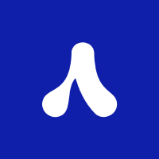
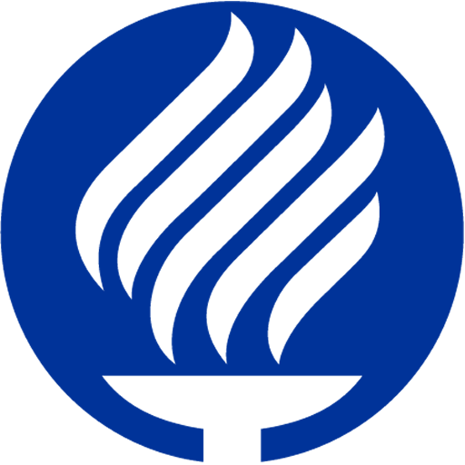

<<<<<<< HEAD

### <h1> Hi!👋 Welcome to Algoritmia !</b>

  
=======
### <h1> Hi!👋 Welcome to Algoritmia 🇲🇽🔵</b>

Algoritmia is a student club dedicated to fostering technical skills and problem-solving abilities among its members. Throughout our journey, we have become the largest programming club in western Mexico 🇲🇽, encouraging personal and collective growth through weekly gatherings held on Saturdays. During these meetings, students come together to solve problems, engage in friendly conversations, and exchange knowledge.

## Our Slogan: "Connect the Dots" ✏️
>>>>>>> 48e4f9d66772e0707227958eef943ac2cb458878

*Student Group from [TEC Campus Guadalajara](https://tec.mx/es)* 
  
## 💡 About us

<<<<<<< HEAD
__Algoritmia__ is a student club dedicated *to fostering technical skills and problem-solving abilities among its members*. For years, we have been a community that encourages personal and collective growth through weekly gatherings held on Saturdays. During these meetings, students come together to solve problems, engage in friendly conversations, and exchange knowledge.

## ✏️ Our Slogan: "Connect the Dots"

Our slogan, *"Connect the Dots"* is symbolized by our logo, which depicts a binary tree with one side larger than the other. This asymmetry represents the magic of our club, where each member contributes their unique dots of knowledge to the community. As we come together, we connect these individual dots, forming a comprehensive understanding that helps us achieve our goals.

## ⏰ Weekly Gatherings

Every Saturday, our club members convene for a collaborative and enriching experience. During these weekly sessions, we dedicate time to tackle coding challenges, discuss algorithmic approaches, and share insights. Through this collective effort, we foster an environment that encourages learning, problem-solving, and the exchange of ideas.

## 🤝 Join Us 

If you are a student passionate about coding, algorithms, and continuous learning, we invite you to join Algoritmia. Become a part of our vibrant community, where you can contribute your dots of knowledge and connect them with those of your peers. Together, we can unlock the magic of problem-solving and achieve our technical aspirations.

## ✉️ Get Involved 
=======
## Weekly Gatherings ⏰

Every Saturday, our club members convene for a collaborative and enriching experience. During these weekly sessions, we dedicate time to tackle coding challenges, discuss algorithmic approaches, and share insights. Through this collective effort, we foster an environment that encourages learning, problem-solving, and the exchange of ideas.

## Join Us 🤝

If you are a student passionate about coding, algorithms, and continuous learning, we invite you to join Algoritmia. Become a part of our vibrant community, where you can contribute your dots of knowledge and connect them with those of your peers. Together, we can unlock the magic of problem-solving and achieve our technical aspirations.

## Get Involved ✉️
>>>>>>> 48e4f9d66772e0707227958eef943ac2cb458878

- Join our weekly Saturday gatherings
- Participate in coding challenges and problem-solving sessions
- Share your knowledge and learn from others
- Connect with like-minded individuals passionate about technology

Let's embark on this journey together and experience the power of at Algoritmia, whether you want to learn something or get inspired you need to "Connect the Dots" .